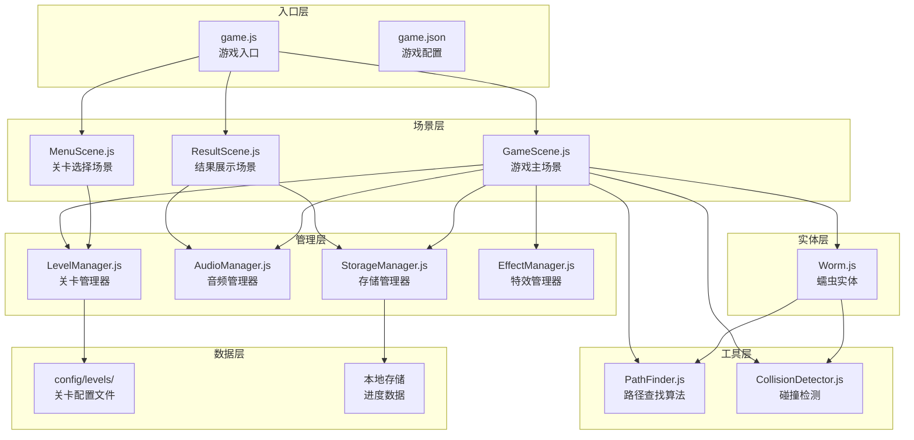
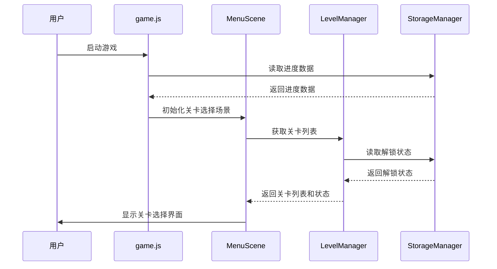
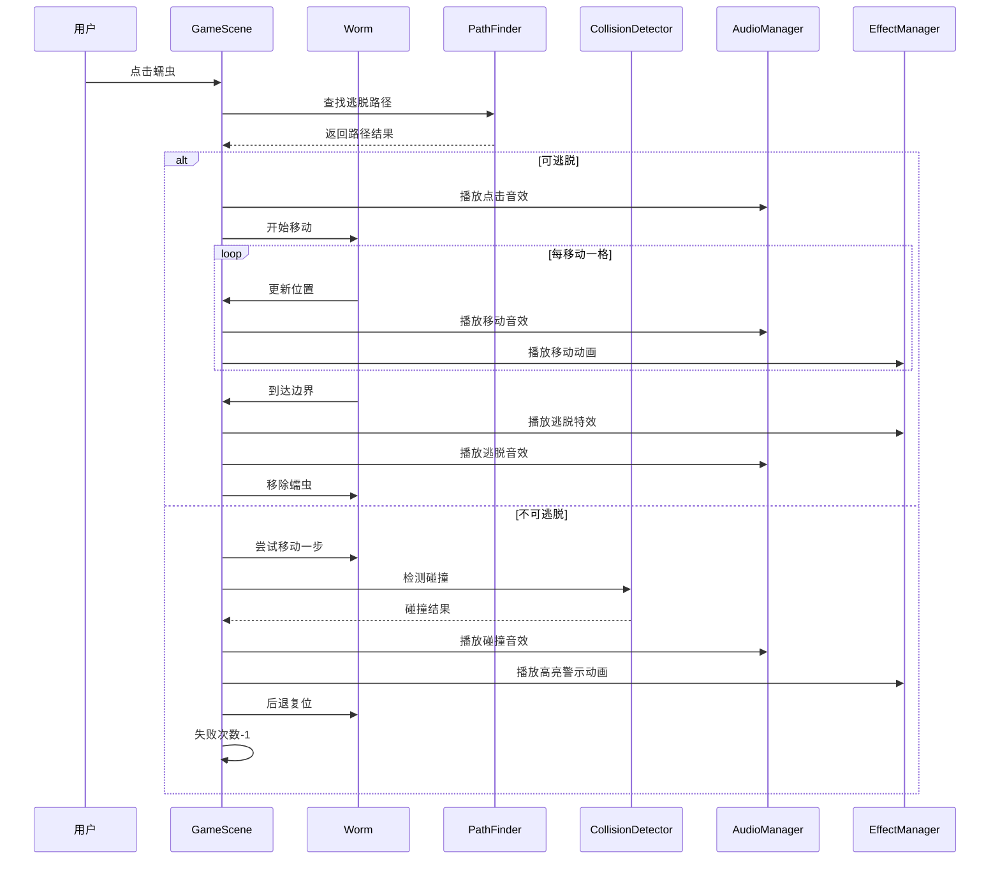
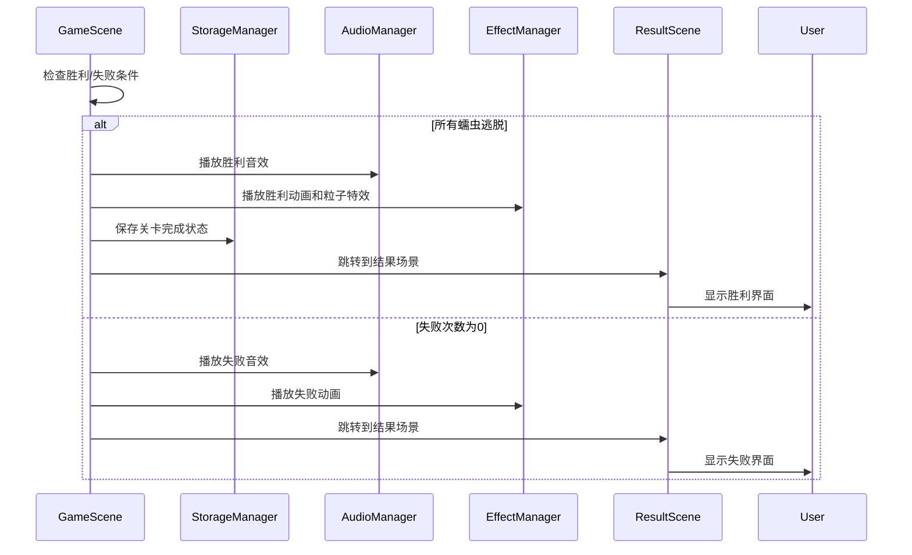
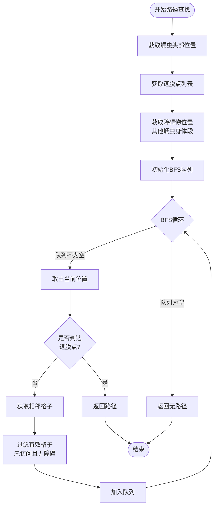
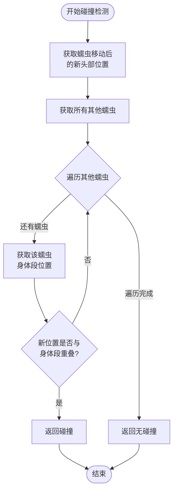

# 蠕虫逃脱游戏系统架构文档

## 1. 系统架构概览

本游戏采用模块化架构设计，主要分为场景层、管理层、实体层和工具层。

## 2. 系统架构图

## 3. 模块详细说明

### 3.1 入口层

#### game.js
- **职责**：游戏主入口，初始化游戏引擎
- **功能**：
  - 初始化微信小游戏环境
  - 注册场景
  - 处理全局事件

#### game.json
- **职责**：游戏配置文件
- **内容**：
  - 游戏基本信息
  - 资源路径配置
  - 屏幕适配配置

### 3.2 场景层

#### MenuScene.js - 关卡选择场景
- **职责**：显示关卡列表，处理关卡选择
- **主要功能**：
  - 渲染关卡网格列表
  - 显示关卡状态（解锁/完成）
  - 处理关卡点击事件
  - 跳转到游戏场景

#### GameScene.js - 游戏主场景
- **职责**：游戏核心逻辑场景
- **主要功能**：
  - 渲染游戏界面（矩阵、蠕虫、UI）
  - 处理用户点击事件
  - 管理游戏状态（进行中/胜利/失败）
  - 协调各个管理器
  - 处理蠕虫移动逻辑
  - 触发音效和特效

#### ResultScene.js - 结果展示场景
- **职责**：显示游戏结果
- **主要功能**：
  - 显示胜利/失败动画
  - 显示关卡完成信息
  - 提供重玩/下一关/返回菜单选项
  - 更新进度数据

### 3.3 管理层

#### LevelManager.js - 关卡管理器
- **职责**：管理关卡数据和状态
- **主要功能**：
  - 加载关卡配置（从JSON文件）
  - 验证关卡配置有效性
  - 提供当前关卡数据
  - 管理关卡进度
  - 关卡切换逻辑

#### AudioManager.js - 音频管理器
- **职责**：管理所有音频播放
- **主要功能**：
  - 背景音乐播放/暂停/停止
  - 音效播放（点击、移动、碰撞、逃脱、胜利、失败）
  - 音量控制
  - 音频开关控制
  - 音频资源预加载

#### StorageManager.js - 存储管理器
- **职责**：管理本地数据存储
- **主要功能**：
  - 保存/读取关卡解锁状态
  - 保存/读取关卡完成状态
  - 保存/读取游戏设置
  - 数据持久化

#### EffectManager.js - 特效管理器
- **职责**：管理所有视觉特效
- **主要功能**：
  - 粒子特效（逃脱、胜利）
  - 动画效果（移动、碰撞警示、复位、胜利、失败）
  - 特效资源管理
  - 特效生命周期管理

### 3.4 实体层

#### Worm.js - 蠕虫实体
- **职责**：表示单个蠕虫对象
- **主要属性**：
  - id: 蠕虫唯一标识
  - segments: 身体段坐标数组
  - direction: 朝向
  - color: 颜色
  - position: 当前位置
- **主要方法**：
  - move(): 移动蠕虫
  - reset(): 复位到初始位置
  - render(): 渲染蠕虫
  - getHeadPosition(): 获取头部位置
  - getBodySegments(): 获取身体段位置

### 3.5 工具层

#### PathFinder.js - 路径查找算法
- **职责**：计算蠕虫逃脱路径
- **主要方法**：
  - findPath(worm, matrix, obstacles): 查找从蠕虫当前位置到边界的路径
  - canEscape(worm, matrix, obstacles): 判断蠕虫是否可以逃脱
- **算法**：使用BFS（广度优先搜索）或A*算法

#### CollisionDetector.js - 碰撞检测
- **职责**：检测蠕虫碰撞
- **主要方法**：
  - checkCollision(worm, newPosition, allWorms): 检测蠕虫移动到新位置是否会碰撞
  - willCollide(worm, allWorms): 预测蠕虫下一步是否会碰撞
- **检测规则**：检查蠕虫头部新位置是否与其他蠕虫身体段重叠

### 3.6 数据层

#### 关卡配置文件
- **位置**：`config/levels/`
- **格式**：JSON
- **内容**：关卡配置数据（矩阵大小、蠕虫位置、逃脱点等）

#### 本地存储
- **存储内容**：
  - 关卡解锁状态
  - 关卡完成状态
  - 游戏设置（音效开关等）

## 4. 数据流图

### 4.1 游戏启动流程

### 4.2 游戏进行流程

### 4.3 胜利/失败流程

## 5. 核心算法流程

### 5.1 路径查找算法流程

### 5.2 碰撞检测流程

## 6. 模块依赖关系

### 6.1 依赖层次
1. **场景层** 依赖 **管理层** 和 **实体层**
2. **管理层** 依赖 **数据层**
3. **实体层** 依赖 **工具层**
4. **场景层** 直接使用 **工具层**

### 6.2 模块间通信
- **场景 ↔ 管理器**：通过方法调用
- **场景 ↔ 实体**：直接操作实体对象
- **实体 ↔ 工具**：通过静态方法调用
- **管理器 ↔ 数据**：通过文件读取/本地存储API

## 7. 扩展性设计

### 7.1 易于扩展的功能
- **新场景**：继承基础场景类，实现场景接口
- **新特效**：在EffectManager中注册新特效类型
- **新音效**：在AudioManager中添加音效资源
- **新关卡**：添加JSON配置文件即可

### 7.2 可配置项
- 关卡配置（JSON文件）
- 游戏设置（本地存储）
- 资源路径（game.json）

## 8. 性能考虑

### 8.1 优化策略
- **对象池**：复用蠕虫对象，减少创建销毁开销
- **路径缓存**：缓存路径查找结果（当其他蠕虫未移动时）
- **渲染优化**：只渲染可见区域
- **资源预加载**：提前加载关卡配置和音频资源

### 8.2 内存管理
- 及时释放不使用的资源
- 使用对象池管理频繁创建的对象
- 避免内存泄漏（及时清理事件监听器）

## 9. 错误处理

### 9.1 异常情况处理
- **关卡配置错误**：显示错误提示，返回菜单
- **路径查找失败**：判定为不可逃脱
- **存储读写失败**：使用默认值，记录日志
- **资源加载失败**：显示加载错误，提供重试

### 9.2 容错机制
- 配置验证：加载时验证配置有效性
- 边界检查：所有坐标操作前检查边界
- 空值检查：避免空指针异常

